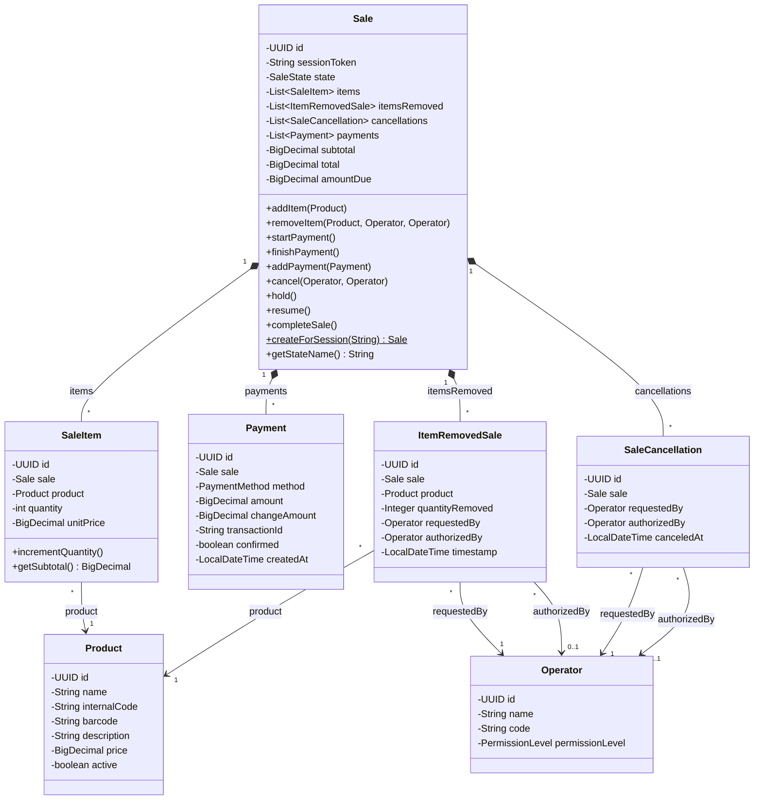
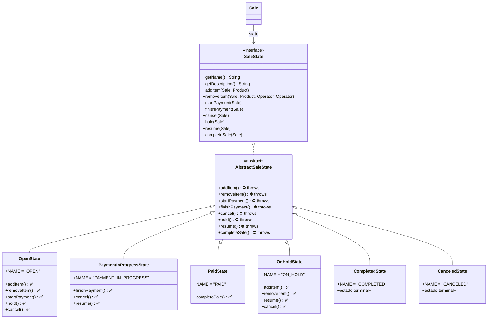
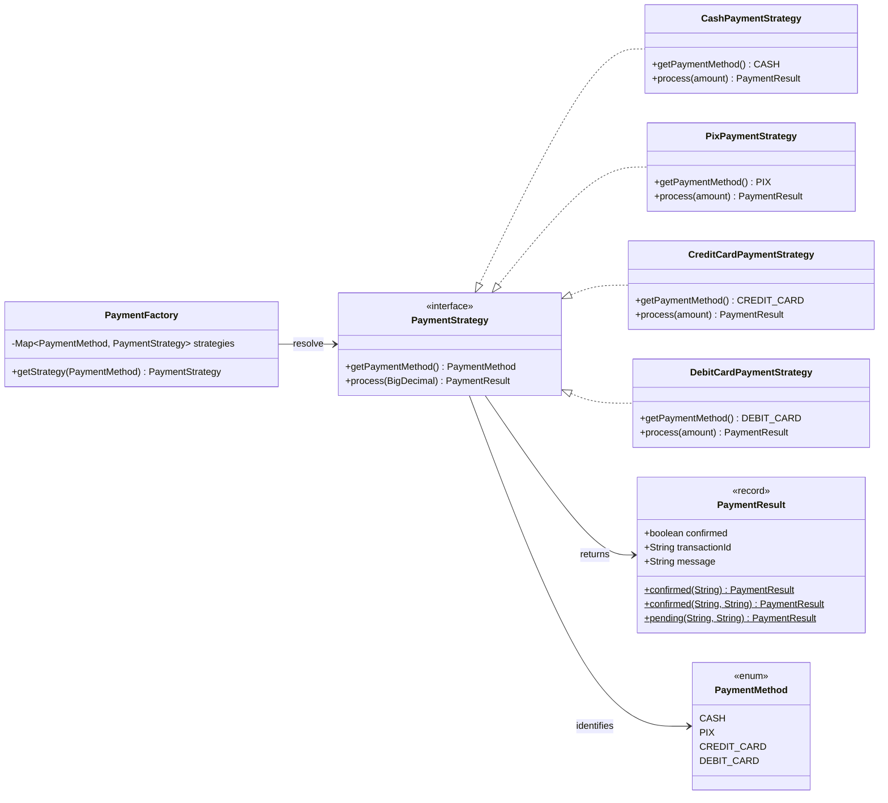
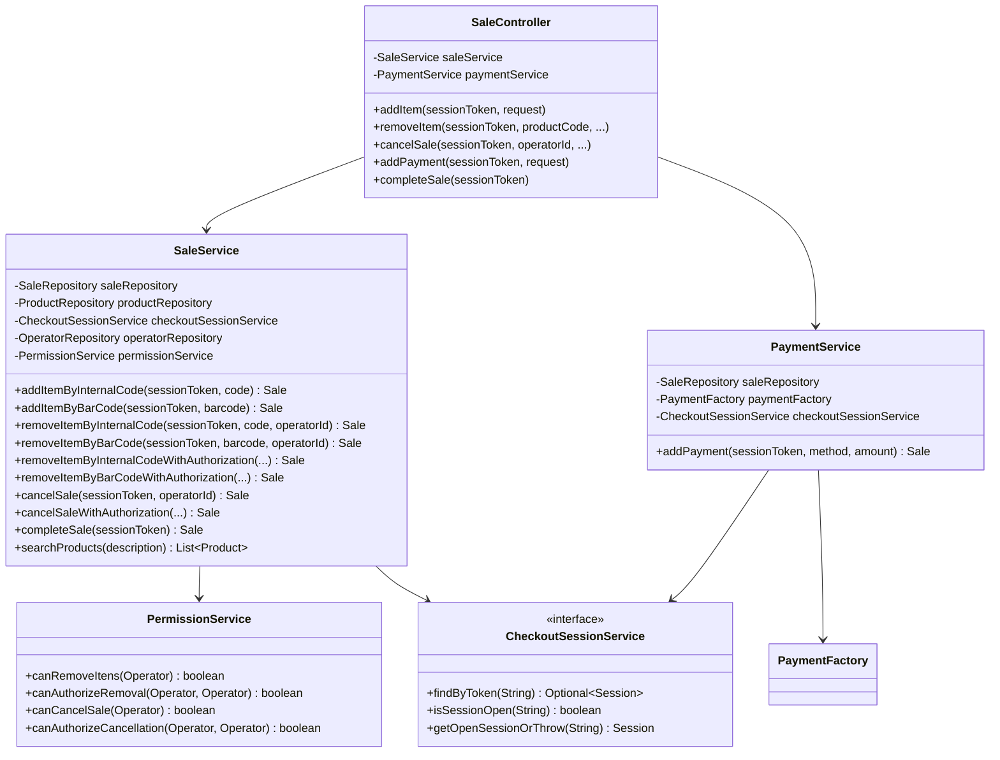
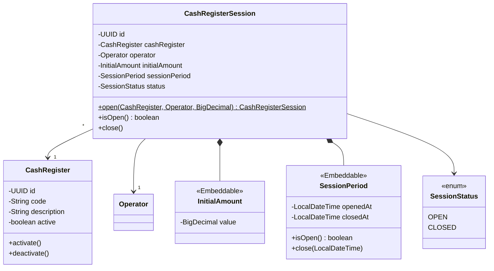
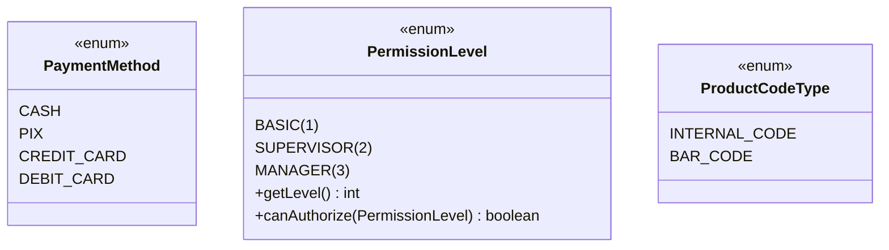

# Diagrama de Classes — Kalles Sale (PDV)

> Visão geral das entidades, serviços, patterns e seus relacionamentos.

## 1. Entidades de Domínio (Core)

## 2. State Pattern (Estado da Venda)

## 3. Strategy Pattern (Pagamento)

## 4. Camada de Serviço

## 5. Cash Register (Caixa Registradora)

## 6. Enums

