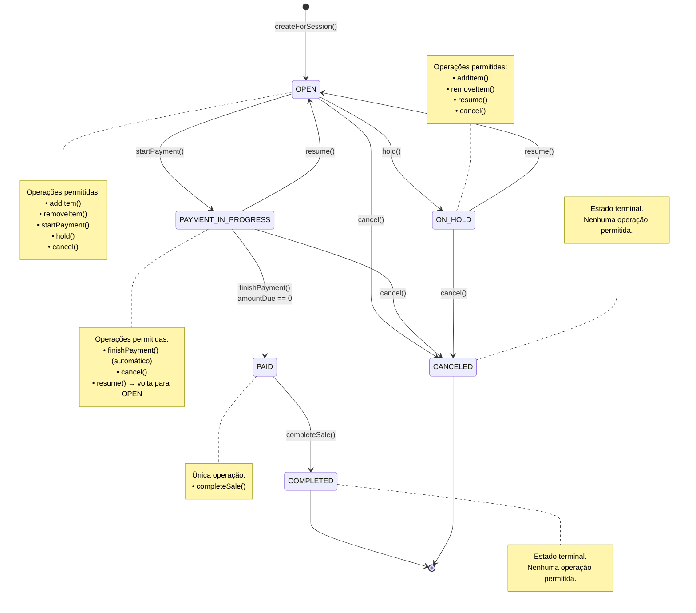

# Diagrama de Estados — Sale (Venda)

> Representa todas as transições possíveis de estado de uma `Sale` no sistema PDV Kalles.



## Regras de Negócio por Transição

| Transição                  | Trigger           | Regra                                                  |
| -------------------------- | ----------------- | ------------------------------------------------------ |
| OPEN → PAYMENT_IN_PROGRESS | `startPayment()`  | Inicia o pagamento, calcula `amountDue = total`        |
| PAYMENT_IN_PROGRESS → PAID | `finishPayment()` | Automático quando `amountDue == 0` após `addPayment()` |
| PAID → COMPLETED           | `completeSale()`  | BR009: `amountDue` deve ser ≤ 0                        |
| OPEN → ON_HOLD             | `hold()`          | Venda pausada pelo operador                            |
| ON_HOLD → OPEN             | `resume()`        | Venda retomada                                         |
| \* → CANCELED              | `cancel()`        | Requer permissão (SUPERVISOR+) ou autorização          |

## Fluxo Típico (Happy Path)

```
OPEN → (addItem) → OPEN → (startPayment) → PAYMENT_IN_PROGRESS
     → (addPayment até amountDue=0) → PAID → (completeSale) → COMPLETED
```
